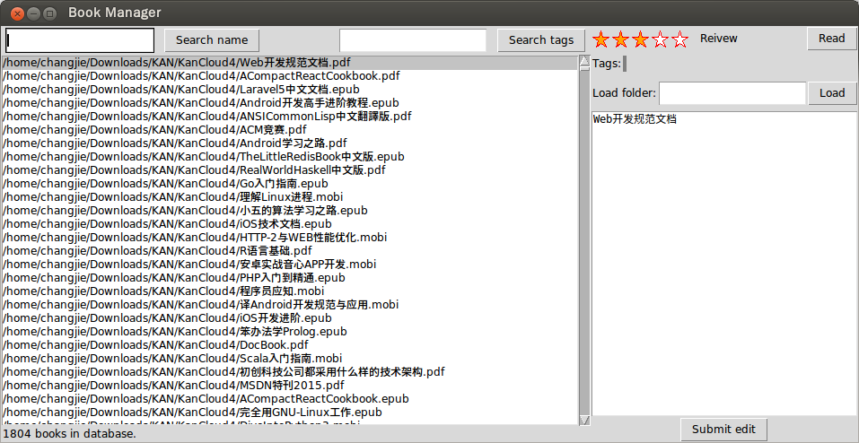
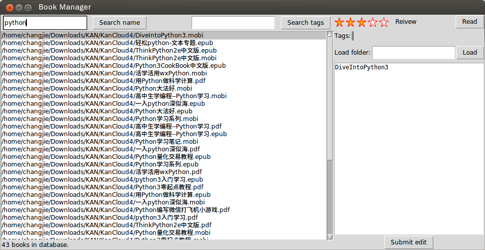
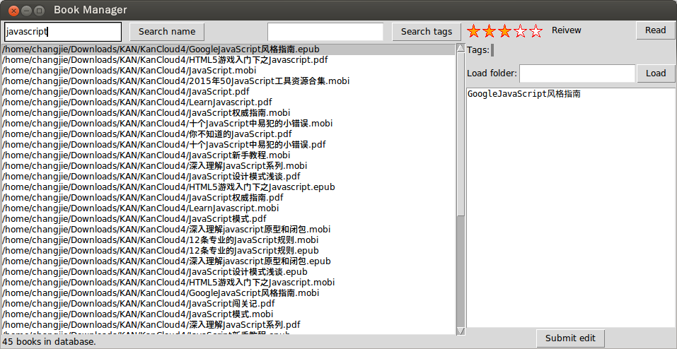
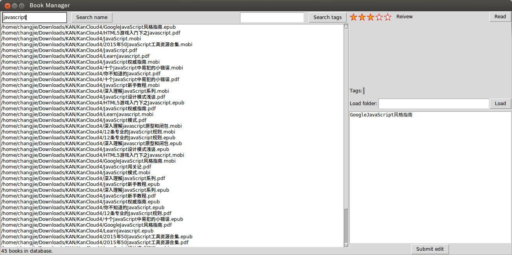

# Easy book manager
[toc]
## Introduction

This project uses Python with Tkinter and MySQL database to create an ebook manager.


## Functions of this book manager

###Basic functions
- [x] A logger to record important manipulations
- [x] Resizable windows
- [x] Create 5 stars using canvas which stands for the review score
- [x] Load a folder and its subfolders, and select all ebooks
- [x] Store book records to MySQL database
- [x] Show book list,tags, score, and book description
- [x] Select and open a book from the listbox
- [x] Search ebooks by name
- [ ] Search ebooks by tag
First, we need to set tags for books. The entry should support auto completion
- [ ] Set tags
Add an entry and button. Check if a tag is already existed.
- [ ] Set review score
Set callback of the review component. May use `Queue()` to send data to the main window.
- [ ] Set book description
Set a callback function.
- [ ] Change book name both for database and the file on disk.
Set a double-click bind which pops up a dialog to set the new name

### Extensions
Create a virtual file tree which allows to categorize books by collections.

## Requirements
- Python 2.x
- MySQL server
- MySQLdb
- Tkinter
- A pdf reader and a epub/mobi reader

##Installation
- First setup your database; create a database and a user, and grant rights to the user
- Copy all files and run `BookManager.py`

##Demo
###Load from folders and save to database
Below is the log:
```
2016-11-28 04:28:56,555 - BookManager.py:234 - tst - Database loads folder : /home/changjie/Downloads/KAN/KanCloud4
2016-11-28 04:30:00,907 - BookManager.py:243 - tst - Database added 1779 books.
2016-11-28 05:05:22,604 - BookManager.py:237 - tst - Database loads folder : /media/changjie/Windows/E/Onedrive/ebooks/Optimization
2016-11-28 05:05:23,502 - BookManager.py:246 - tst - Database added 25 books.
```

###Default view 
The default selection is the first entry in the listbox. Discription is displayed in the right `Text` widget. The description is defaultly set to the book name. And the default review score is 3/5. No tags are set defaultly.



###Search by name
The `listbox` and related views are updated when the user presses the search button. 



###Cancel search
When the search entry is empty, restore the window view to its default view; thus we can research another term and so on.



###Resize window

